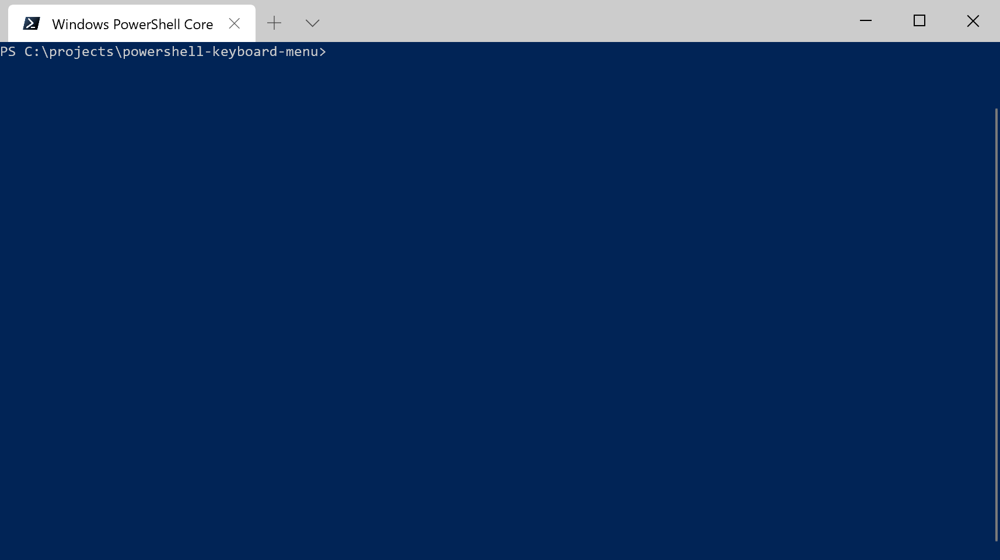

# Introduction
This is a script that I have been enhancing and using for a while. 

It displays a menu in powershell that enables:
- Keyboard navigation
- Selection by number
- Ordered / un-ordered menu items

# Usage

See `./examples/run.ps1` for more detailed examples

```powershell
Import-Module ./src/menu.psm1

Invoke-ShowMenu "Please select" $([ordered]@{ "Value One" = "Option One"; "Value Two" = "Option Two"; "Value Three" = "Option Three" })
```

